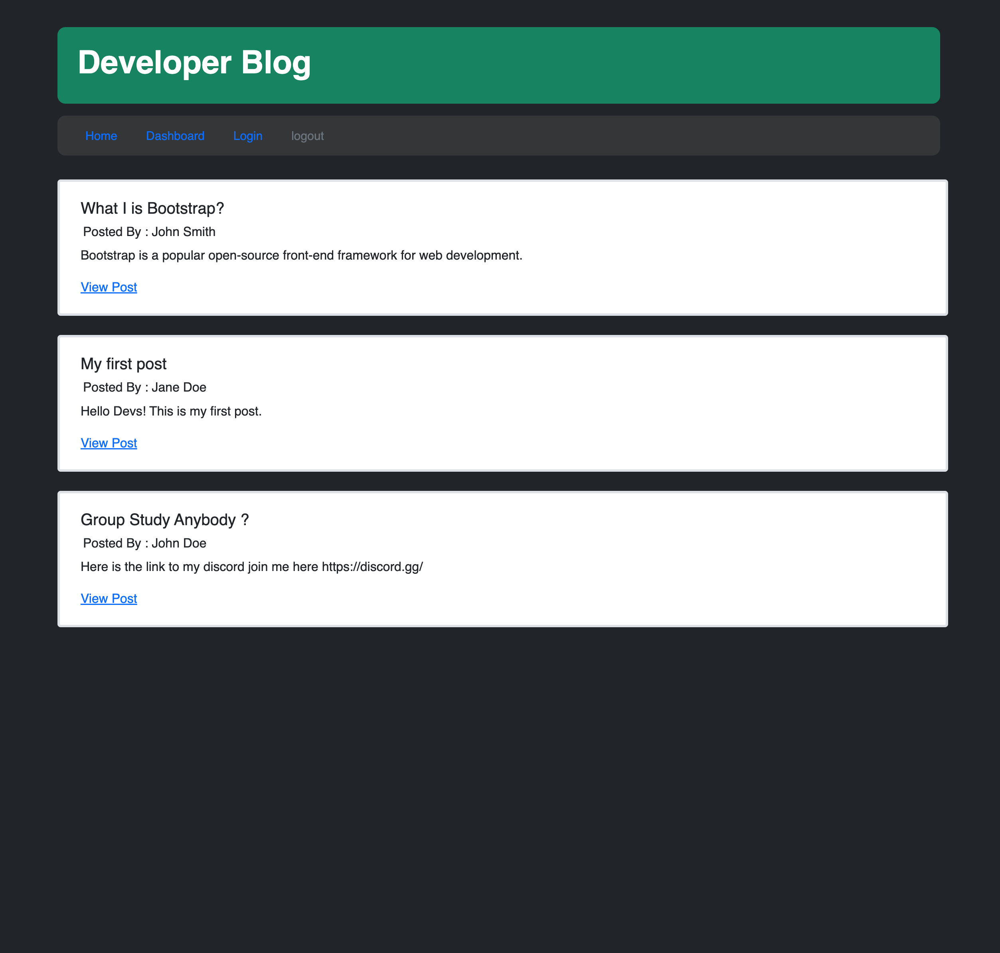

# Developer's World Blog, MVC- MODEL CONTROL VIEW 

### Resources
[GitHub Repository](https://github.com/Truecoding4life/Developer-blog-with-model-view-control)

[Deployed Link](https://truecoding4life.github.io/html-refactor/)

[Jay's Studio](https://truecoding4life.github.io/Jaystudio/)

#### Table of Contents
* [Resources](#resources)
* [Description](#description)
* [Technologies Used](#technologies-used)
* [Installation](#installation)

---

## Description 

Welcome to the Developer Blog website, your platform for freely sharing your thoughts about the latest and greatest in technology, the most creative design ideas, and more. To unlock the full potential of our platform, simply log in with your email address and password. Once logged in, you're ready to unleash your ideas and insights to the world.

---

### User Interface

The Developer Blog website features an intuitive and user-friendly interface, with a clear header for easy navigation to 'Home,' 'Blog Posts,' 'Technology,' and 'Design Ideas.' The homepage presents the latest blog posts. Registered users can effortlessly create and share their own posts using the user-friendly text editor powered by Handlebars. A user profile dashboard and responsive design ensure a seamless experience, facilitating exploration of technology and design topics, fostering engagement, and enabling users to contribute their insights to the community.

---

---

# Technologies Used

**sequelize:** Sequelize is a powerful Object-Relational Mapping (ORM) library for Node.js that simplifies database interactions. It provides an easy-to-use API for defining data models, executing queries, and handling relationships between database tables.

**Bootstrap:** Bootstrap is a widely used front-end framework that provides a collection of pre-designed and responsive CSS and JavaScript components. It simplifies web development by offering ready-made templates, layouts, and UI elements, enabling developers to create visually appealing and mobile-friendly web applications quickly.

**Handlebars:** Handlebars is a templating engine that streamlines the process of generating dynamic HTML content in web applications. It allows developers to create reusable templates with placeholders, making it easy to insert data dynamically into web pages.

**JavaScript:** JavaScript is a versatile and widely used programming language for web development. It enables you to add interactivity, manipulate the DOM (Document Object Model), and perform various client-side actions in web applications.

**Node.js:** Node.js is a server-side JavaScript runtime that allows developers to build scalable and efficient network applications. It provides a non-blocking, event-driven architecture that is particularly well-suited for creating server-side applications.

**Express Node.js:** Express.js is a minimal and flexible web application framework for Node.js. It simplifies the creation of web servers and the development of web applications by providing essential features and middleware for routing, handling requests, and more.

**bcrypt:** bcrypt is a password-hashing library used for securely storing user passwords. It employs a one-way hashing algorithm, making it difficult for attackers to reverse-engineer stored passwords.

**connect-session-sequelize:** connect-session-sequelize is a middleware for Express.js that facilitates the integration of session management using Sequelize, a popular Object-Relational Mapping (ORM) library for Node.js. It enables the secure storage of user session data in a database.

**dotenv:** dotenv is a module that simplifies the management of environment variables in Node.js applications. It allows you to store configuration settings in a .env file, making it easy to maintain and protect sensitive information.

**express-session:** express-session is a middleware for Express.js that handles user sessions in web applications. It manages the session state and enables user-specific data to persist across multiple HTTP requests.

**mysql2:** mysql2 is a Node.js-based MySQL driver that simplifies the interaction with MySQL databases. It allows you to establish database connections, execute queries, and manage data effectively.

**path:** The 'path' module in Node.js provides utilities for working with file and directory paths. It simplifies tasks such as joining, normalizing, and resolving paths, which is particularly useful for file I/O operations.

**sess:** The 'sess' (possibly related to session) component likely refers to a custom module or script you've developed for your web application. It may be used for managing user sessions or handling other specific functionalities within your project.

**route-express middleware:** Route-Express middleware is a custom middleware component developed for your web application using the Express.js framework. It is used to handle routing and request processing in a way that is specific to your project's requirements. This middleware likely plays a key role in managing the flow of incoming requests and their respective routes within your application, allowing for custom handling of various routes and actions.

---

### Installation

To get started with the online Developer Blog website, begin by accessing the website through your web browser. Next, sign up by clicking the "Register" or "Sign Up" button, providing your email address and selecting a secure password. After registration, log in using your email and password to access your account. You'll then have full access to explore blog posts, technology discussions, and design ideas shared by other users. To contribute, create your own posts by clicking "Create Post" or "Share Your Idea," using the text editor to write and enhance your content with images, videos, and media. Publish your post to share it with the community. Engage with others through comments and discussions, manage your profile, stay updated on website notifications, and remember to log out when you're done. Enjoy your experience on the Developer Blog website and join the creative conversations.
  

---

## Designing Process
I spent most of my time of constructing a clear idea of what my model and files directories going to looks like, then I went on and map out what each directories should include following the Model-View-Control setup.

#### PSEUDO-CODE
Creating directories within the convention of MVC (Model-View-Control)
- controllers, views, models folders
- server.js
#### MODELS
- Setting up your database
- index to tie it all together
- User, Post, Comments (Users <-> Posts/Comments one to many relationships)
    - User -> id, username, password
        - encrypt password, need some hooks
    - Post -> id, title, description, date/timestamp(sequelize can do this for you, research!), fk_user_id
    - Comments -> id, description, fk_post_id, fk_user_id
#### VIEWS
- handlebars
- login/sign up, homepage, dashboard, post(comments/new comment-partial), new-post(edit-post)
- folders for layouts and partials if you plan to use them
    - layouts main? partials post/comment?
#### CONTROLLERS
- routes! /api/ and home
- index -> api routes, home routes
- home routes -> (get) '/', '/login/', '/post/:id', '/user/:id'(for the dashboard)
- /api/ index, user, (blog)post, comments
    - get, post, put, delete
    - index -> user routes, post routes, comment routes
    - (blog)post -> :id, title, description, (includes user)
    - user -> :id, username, password
    - comments -> :id, description (includes post/user), could do post.includes(comments)
#### Basics
- server file, .env, .gitignore, readme
- public (css, img, js)
- config(connection)
- db(schema)
- seeds(index, postData?, commentData?)
- utils(auth, helpers)
#### SERVER
- NPMs: path, express, express-session, express-handlebars, sequelize, dotenv, 
- middleware: 
    - app.use express.json/urlencoded/static(public)
    - engine, handlebars, helpers, session
- session: secret, cookie

#### MODEL
Users <-> Posts/Comments one to many relationships)

---

#### This README was generated based on the Good README Guide

This Website is made available by © Jay's Studio 

